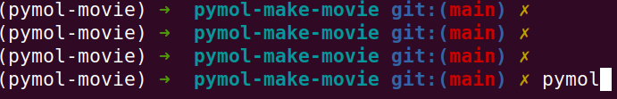
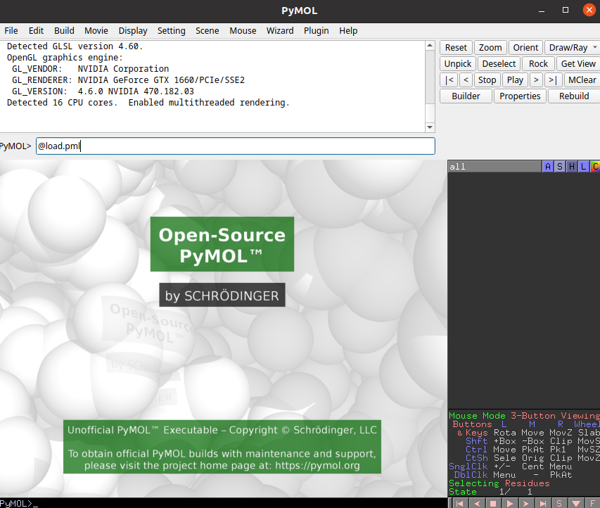
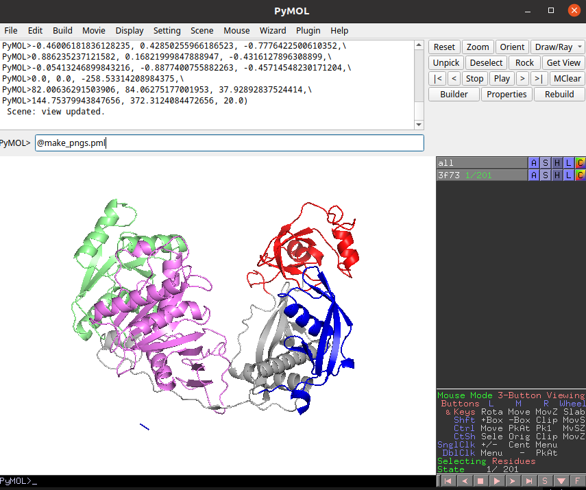

# pymol-make-movie
PyMOL Movie Template: A simple and customizable template for creating movies from MD trajectories using PyMOL

## Create a virtual environment
```
conda create --name pymol-movie python=3.8
```

## Activate the environment
```
conda activate pymol-movie
```

## Install Requirements
```
conda install -c conda-forge pymol-open-source
conda install -c conda-forge jupyterlab
conda install -c conda-forge ffmpeg-python
```

## PyMOL
### Open pymol in terminal


### load pdb, xtc and update colorscheme

### Generate png files


## Make movie by ffmpeg
- make_movie.ipynb